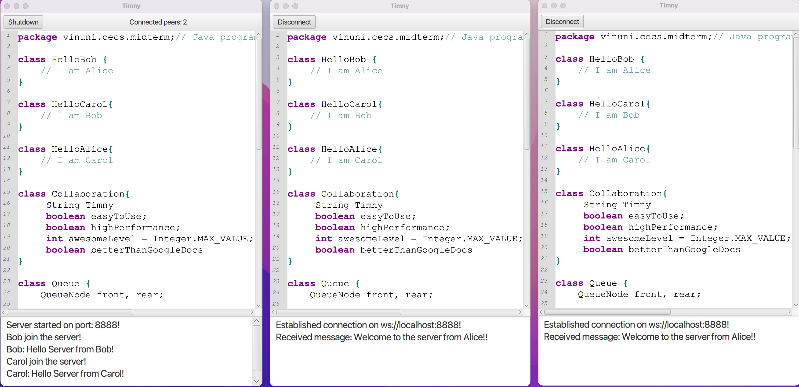

# Timny: A realtime collaborative code editor
> This is an educational project, not intended for production

Timny is a realtime collaborative code editor that runs on local network.

This project is my final project for Object-Oriented Programming(OOP) course.
It uses CRDT and WebSocket to allow realtime collaboration. Timny also has syntax highlighting for Java.

